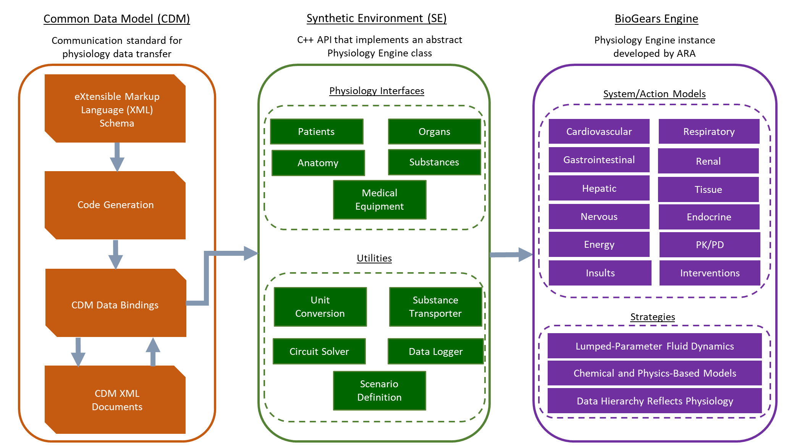

# Summary

BioGears is an open source, extensible human physiology computational engine that is designed to enhance medical education, research, and training technologies. BioGears is primarily written in C++ and uses an electric circuit analog to characterize the fluid dynamics of the cardiopulmonary system. As medical training requirements become more complex, there is a need to supplement traditional simulators with physiology simulations. To this end, BioGears provides an extensive number of validated injury models and related interventions that may be applied to the simulated patient. In addition, BioGears compiled libraries may be used for computational medical research to construct *in-silico* clinical trials related to patient treatment and outcomes. Variable patient inputs support diversity and specification in a given application. The engine can be used standalone or integrated with simulators, sensor interfaces, and models of all fidelities. The Library, and all associated projects, are published under the Apache 2.0 license and are made available through the public GitHub repository. BioGears aims to lower the barrier to create complex physiological simulations for a variety of uses and requirements.

Physiological models have been used for healthcare simulation for many years but generally, complex models of the human physiology are not implemented and the patient state is preprogrammed by the instructor. The most prominent commercial implementation of similar software is Maestro, developed by Canadian Aviation Electronics, Inc. This product is proprietary and it is not clear to the authors how models are developed, implemented, and validated. Other similar open source projects include: [pk-sim](https://github.com/Open-Systems-Pharmacology/PK-Sim) the pharmacological modeling framework [@willmann2003pk], CellML a generic biological modeling markup language with applications spanning biological applications [@lloyd2004cellml], and [Pulse](https://gitlab.kitware.com/physiology/engine) a maintained BioGears fork lacking some of the recent models but instead focusing on Unity VR integration. Each of these either has submodels that are integrated into BioGears (like a pkpd pharmacological model), or is a more generic implementation of biological modeling, like CellML. BioGears is unique in the depth of integrated models, while being free and open-source for the research community.

# Statement of need 

The fields of Medical simulation and computational medicine are growing in application diversity and complexity [@sweet2017crest]. Simple CPR manikins are now being replaced with complex robotic systems that can simulate breathing and react to the performance of the trainee. As these systems use-cases grow, there is a requirement that they be supplemented with physiology modeling. BioGears fills this need by providing a free computational framework to use as a backbone to many of these robotic training manikins and may support other computational medicine research applications. The BioGears project aims to better democratize the construction of high-fidelity medical training by providing a sophisticated, complex physiology engine to developers that is easy to integrate and free to use.

BioGears uses a lumped circuit model to describe the circulatory and respiratory systems. This approximation of the simulated cardiopulmonary system has been studied in the past and shown to accurately represent the hemodynamics of the arterial system by using resistance and compliance elements [@otto1899grundform; @westerhof2009arterial]. This approximation creates a system that can be solved for rapidly, decreasing the simulation run-time and computational requirements. In addition, BioGears implements models of diffusion and substance transport to properly simulate the gas/blood interface in the lungs. To handle more complex models of physiology, such as pharmacological models, BioGears constructs a set of hierarchal compartments built on top of the circuit analogs. Top-most compartments represents the system level data, such as the liver, with sub-compartments representing more granular biology of the patient such as the nephron, extravascular tissue, and even intracellular spaces. A generic data request framework, leveraging XML, is used to access various substance, fluid, thermal, and gas information for a specific compartment of the body. 

The BioGears engine has been used in numerous applications that include computational medical research. This work has extended the engine to support models of sepsis [@mcdaniel2019whole], burn [@mcdaniel2019full], surgical planning  [@potter2017physiology], and pharmacological kinetics and clearance [@mcdaniel2019open]. For each application, the patient physiology and traditional interventions used to treat each injury are validated. Full documentation and validation for every action available to the user is provided through our [website](https://www.biogearsengine.com/).

New dugs can be implemented in BioGears by filling in the appropriate physiochemical properties in the provided eXtensible Markup Language (XML) format. The BioGears engine handles computation of clearance, tissue diffusion, and patient responses based on this file and does not require additional C++ programming by the user. The software architecture of BioGears is implemented in three layers of abstraction to encourage easy integration and provide a robust application programming interface (API), see \autoref{fig:example}




# Features

The BioGears engine, once compiled, provides a set of libraries that may be included in any application that wishes to leverage a physiological simulation of a patient. In addition, BioGears provides build support and testing for all major user platforms (MacOS, Windows, Linux, and ARM). An instance of a BioGears engine models a single patient's physiology and can be edited at the start of runtime or during the simulation, in the following ways: 

- The patient is defined by parameters, such as height, weight, systolic and diastolic pressure.
- Initialize the patient with specific chronic and/or disease states via conditions.
- Modify the patients external environmental conditions (weather, submerge in water, etc.)
- Apply various actions: acute insults/injuries, interventions, conscious breathing, exercise, etc.
- Interact with equipment models, such as an Anesthesia and/or an ECG Machine as well as an Inhaler via the action framework.

Constructing a pointer to an engine, loading a patient, creating data requests (published to a given .csv file), and applying actions to the patient is easy and can be done in only a few lines of code:

```C++
using namespace biogears;
void HowToFaciculation()
{
  // Create the engine and load the patient
  std::unique_ptr<PhysiologyEngine> bg = 
  CreateBioGearsEngine("HowToFasciculation.log");
  bg->GetLogger()->Info("HowToFasciculation");

  if (!bg->LoadState("./states/StandardMale@0s.xml")) {
    bg->GetLogger()->Error("Could not load state, check the error");
    return;
  }
  
  // Set data requests and create output file
  bg->GetEngineTrack()->GetDataRequestManager().
  CreateLiquidCompartmentDataRequest().
  Set("VenaCava", *Na, "Molarity", AmountPerVolumeUnit::mmol_Per_L);
  bg->GetEngineTrack()->GetDataRequestManager().
  SetResultsFilename("HowToFasciculation.csv");

  // Advance Simulation time by 1 minute 
  bg->AdvanceModelTime(1.0, TimeUnit::min); 

  // Create an AirwayObstruction action with a severity of .6
  obstruction.GetSeverity().SetValue(0.6);
  bg->ProcessAction(obstruction);
  
  bg->GetLogger()->Info("Giving the patient an airway obstruction.");
  for( auto i = 0; i < 60*60; --i){ 
     //Advance time for 1 hour and log EngineTracks to ouput
     bg->AdvanceModelTime(1.0, TimeUnit::s);  
     m_Engine.GetEngineTrack()->
     TrackData(m_Engine.GetSimulationTime(TimeUnit::s),m_append_data);
  }
``` 

The Biogears project includes 36 complete howto's which demonstrate various uses of the API and a versatile command line utility for running XML defined Scenarios using the CDM. Additional support can be found by going to <https://biogearsengine.com/>, <https://www.biogears.dev/>, or by joining our IRC [slack channel](https://github.com/BioGearsEngine/core/wiki/Getting-access-to-our-IRC-development-channel).


# Acknowledgements

This work was made possible by cooperative agreements that were awarded and administered by the US Army Medical Research & Materiel Command (USAMRMC) and the Telemedicine and Advanced Technology Research Center (TATRC), at Fort Detrick, MD, under Contract Number W81XWH‐13‐2‐0068 and W81XWH-17-C-0172. We'd like to acknowledge the support and guidance of Hugh Connacher, Harvey Magee, and Geoff Miller.

# References
